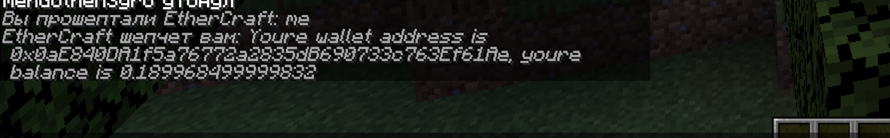

## Simple Ethereum Minecraft Bot
___
**Simple** Minecraft Bot *Template/Example* for iteract with EVM-chains

*/tell EtherCraft create* - create wallet
*/tell EtherCraft me* - get wallet and balance
*/tell EtherCraft send* address amount - transfer coins to address

